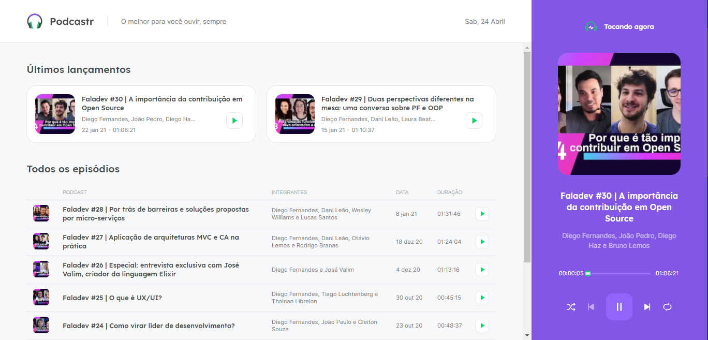

<div align="center">
  
</div>

<br>

<p align="center">
  
</p>

## :hammer_and_pick: Technologies

This project was developed using the following technologies:

- Next.js
- React
- TypeScript

## Preview
[](https://podcastr05-camiladcm.vercel.app/)

## 🚀 Getting started

### Requirements

- You need to install Node.js and Yarn to run this project.

**Clone the project and access the folder**

```bash
$ git clone https://github.com/camiladcm/podcastr-nlw05.git && cd podcastr-nlw05
```

**Follow the steps below**

```bash
# Install the dependencies
$ yarn

# Run the backend fake server
$ yarn server

# Run the web server
$ yarn dev
```

## 💻 Project

This project was developed during the Next Level Week, presented by Rocketseat.  

## 📝 License

This project is licensed under the MIT License. See the [LICENSE](LICENSE.md) file for details.


---

Made by: Camila Marçal
